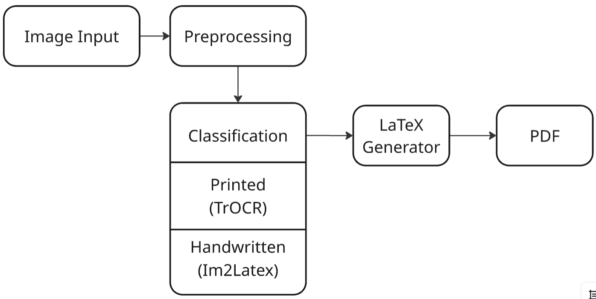

# InstaTexScanner

InstaTexScanner is a deep learning system that converts handwritten and printed mathematical documents into valid LaTeX markup. The system automatically detects content type (handwritten or printed), performs appropriate recognition, and produces compilable LaTeX output with high accuracy.



---

## 📋 Table of Contents
- [🚀 Project Overview](#-project-overview)
- [👥 Team](#-team)
- [🏗️ System Architecture](#-system-architecture)
- [🚀 Quick Start](#-quick-start)
- [📊 Model Performance](#-model-performance)
- [🔧 Technical Details](#-technical-details)
- [📁 Project Structure](#-project-structure)

---

## 🚀 Project Overview

Traditional OCR tools struggle with complex mathematical notation and handwritten expressions. InstaTexScanner addresses this gap by combining:

- **Custom Im2Latex Model**: 2.5M parameter encoder-decoder architecture with attention for handwritten formula recognition
- **TrOCR Integration**: Pre-trained transformer model for printed text recognition
- **Intelligent Classification**: Automatic detection of handwritten vs printed content
- **End-to-End Pipeline**: From image input to compilable LaTeX output

---

## 👥 Team

**Petr Belayev** - Neural Architecture & Im2Latex Model  
`p.belayev@innopolis.university`

**Andrey Krasnov** - Model Training & Hyperparameter Tuning  
`a.krasnov@innopolis.university`

**Askar Kadyrgulov** - Frontend/Backend Integration & Deployment  
`a.kadyrgulov@innopolis.university`

---

## 🏗️ System Architecture

### Pipeline Overview
1. **Input**: User uploads document image
2. **Preprocessing**: Normalization, binarization, resizing to 64×256 pixels
3. **Classification**: Handwritten vs printed content detection
4. **Recognition**:
   - **Printed**: TrOCR model (334M parameters, >95% accuracy)
   - **Handwritten**: Custom Im2Latex model
5. **Output**: Compilable LaTeX code with embedded images

### Model Architecture
```python
Im2Latex Model:
├── Encoder: CNN with batch normalization & dropout
├── Decoder: GRU with multi-head attention
└── Vocabulary: 112 symbols (LaTeX commands, delimiters, control tokens)
```

---

## 🚀 Quick Start

### Prerequisites
- Docker
- Docker Compose

### Deployment
```bash
# Clone the repository
git clone https://github.com/PetrBelayev11/InstaTexScanner.git
cd InstaTexScanner

# Start all services with Docker Compose
docker-compose up -d
```

### Access Points
- **Web Application**: http://localhost:3000
- **API Documentation**: http://localhost:8000/docs

### Stopping the Services
```bash
docker-compose down
```

---

## 📊 Model Performance

| Model | Token Accuracy | Parameters | Use Case |
|-------|---------------|------------|----------|
| Im2Latex (Baseline) | 60.11% | 724K | Handwritten formulas |
| Im2Latex (Improved) | >60% | 2.5M | Handwritten formulas |
| TrOCR | >95% | 334M | Printed text |

### Supported Mathematical Structures
- ✅ Fractions and summations
- ✅ Greek symbols and subscripts/superscripts  
- ✅ Radicals and integrals
- ✅ Matrices and basic equations
- ✅ Nested fractions and moderate complexity

---

## 🔧 Technical Details

### Datasets
- **im2latex-100k**: 83,884 training samples, 9,319 validation samples
- **EMNIST**: Handwritten vs printed classification
- **Custom Augmentation**: Rotation, scaling, noise addition

### Training Specifications
- **Optimizer**: Adam with learning rate 1e-4
- **Loss Function**: Cross-entropy with label smoothing
- **Regularization**: Gradient clipping, dropout, batch normalization
- **Hardware**: NVIDIA GTX 1650 (or compatible CUDA device)

### Key Improvements
1. **Architecture**: Expanded encoder depth with normalization layers
2. **Attention**: Multi-head attention for better feature alignment
3. **Training**: Learning rate warmup and sophisticated scheduling
4. **Vocabulary**: Comprehensive 112-symbol token set

---

## 📁 Project Structure

```
instaTexScanner/
├── code/
│   ├── deployment/
│   │   ├── api/                    # FastAPI backend
│   │   ├── app/                    # Web frontend
│   │   ├── docker-compose.yml
│   │   └── README.md
│   │   
│   └── models/
│       ├── model_im2markup.py      # Main Im2Latex model
│       ├── preprocess.py           # Image preprocessing
│       ├── train_im2latex.py       # Training script
│       ├── test_validation.py      # Model evaluation
│       ├── test_training_setup.py  # Environment verification
│       └── test_train_vs_val.py    # Performance comparison
│
├── datasets/
│   ├── im2latex/
│   │   └── prepare_im2latex.py
│   ├── im2latex_prepared.json      # Processed dataset
│   └── README.md
│
├── models/
│   ├── im2latex_best.pth          # Trained Im2Latex model weights
│   └── tiny_cnn_emnist.pth        # Handwriting classification model
│
└── imgs/
    └── image.png                   # System pipeline diagram
```

---

## 🎯 Future Work

- [ ] Transformer-based decoders for long-range dependencies
- [ ] Synthetic handwriting data generation
- [ ] Multi-modal document processing (text + formulas + graphs)
- [ ] User correction feedback system
- [ ] ONNX optimization for faster inference
- [ ] Mobile app with real-time camera processing